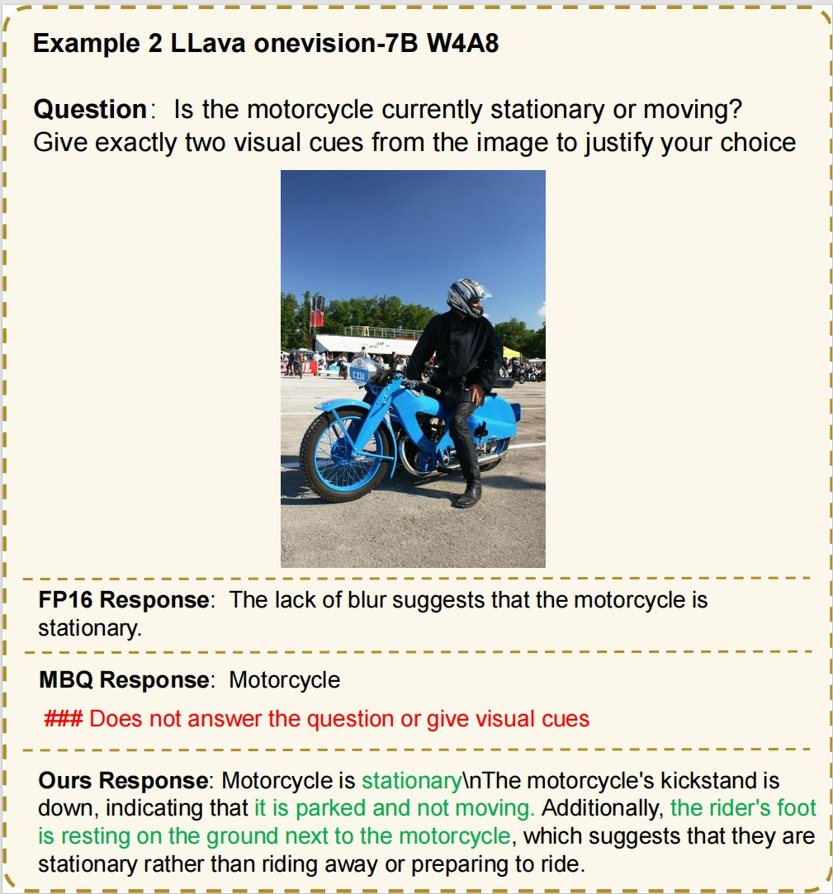

# Fine-Grained Post-Training Quantization for Large Vision Language Models with Quantization-Aware Integrated Gradients

## Installation

1. Create a conda env
    ```bash
    conda create -n qig python=3.11
    ```

2. Install packages and 3rdparty repos.
    ```bash
    # Install LLaVA-NeXT
    cd 3rdparty/LLaVA-NeXT
    pip install -e .

    # Install lmms-eval
    cd 3rdparty/lmms-eval
    pip install -e .

    # Install qig
    pip install -r requirements.txt
    pip install -e .
    ```

## Apply model quantization in `qig` package
### Command-line Interface 

Quantization search for MLLMs is executed based on `main_quant.py`. A variety of arguments are available to configure the quantization search process.

1. Model arguments
    * `--model` : Select which model type is processed during quantization search. Must be a string corresponding to the name of the model type. 
        - only support `internvl2`, `llava_onevision`, `qwen2_vl` now.
    * `--model_args` : Control parameters passed to the model constructor. Accepts a string containing model path", for example `--model_args pretrained=OpenGVLab/InternVL2-8B`.

2. Calibration arguments
   
    QIG is sensitive to the calibration data distribution. For best quantization performance, the calibration set should be aligned with the target evaluation setting in both data type and formatting.
    * `--calib_data` : Select which calibration data type is used during quantization search. 
        - only support `pileval` and `coco` now.
    * `--n_samples` : The number of the samples used in quantization search.
    * `--data_path` : Accept a string of the dataset path.
        - for `pileval` , we use `mit-han-lab/pile-val-backup`.
        - for `coco` , the data need to be a JSON or JSONL file, you can refer to [sharegpt4v](https://github.com/InternLM/InternLM-XComposer/blob/main/projects/ShareGPT4V/docs/Data.md#prepare-images) for data preparation.
    * `--image_folder` : Accept a string of the image folder, you can refer to [sharegpt4v](https://github.com/InternLM/InternLM-XComposer/blob/main/projects/ShareGPT4V/docs/Data.md#prepare-images) for data preparation.
    * `--few_shot_format` : Organize the calibration data in an interleaved format, currently by simply concatenating two samples.
        - this option is valid only when `--calib_data=coco`.
    * `--interleave_format` : Organize the calibration data with image-text pairs and pure text data, currently by simply insert 512 pure text token in two image-text pairs.
        - this option is valid only when `--calib_data=coco`.
    * `--text_data_path` : Accept a string of the pure text dataset path, this dataset will be used in interleave_format, we use `mit-han-lab/pile-val-backup`.

4. Quantization arguments
    * `--method` : Select the quantization search type, support `mbq` , `awq` , `smoothquant` , `rtn` , `qig`.
    * `--run_process` : Specify this parameter to run the quantization search.
    * `--w_bit`: Specify the weight bit.
    * `--w_group`: Specify the group size in `weight-only per-group` quantization.
    * `--a_bit`: Specify the activation bit.
    * `--alpha`: The hyperparameter of Smoothquant.
    * `--reweight`: Specify this parameter to use gradient to reweight the loss during quantization search.
    * `--distort`: Specify this parameter to use distort feature map during quantization search.
    * `--loss_mode`: Select the loss type during quantization search, support `mae` , `mse`.
    * `--scale_path`: The path for saving quantization search results.
    * `--pseudo_quant`: Specify this parameter to perform pseudo quantization for the model.

### Run Quantization
* For quantization, you should specify `--run_process` in the command and provide the appropriate `data path` and `quantization config`.
* The quantization search results will be stored in `scale_path`, and we use the results to perform quantization.

1. Weight-only Quantization with QIG
    ```bash
    python3 -W ignore main_quant.py \
        --model internvl2
        --model_args pretrained="OpenGVLab/InternVL2-8B" \
        --calib_data coco \
        --data_path "your/data/path/" \
        --image_folder "your/image/folder" \
        --n_samples 128 \
        --method qig \
        --run_process \
        --w_bit 3 \
        --a_bit 16 \
        --w_group 128 \
        --reweight \
        --loss_mode mae \
        --scale_path "scale_cache/qig/internvl2_w3a16.pt"
    ```
2. Weight-Activation Quantization with QIG
    ```bash
    python3 -W ignore main_quant.py \
        --model internvl2
        --model_args pretrained="OpenGVLab/InternVL2-8B" \
        --calib_data coco \
        --data_path "your/data/path/" \
        --image_folder "your/image/folder" \
        --n_samples 128 \
        --method qig \
        --run_process \
        --w_bit 4 \
        --a_bit 8 \
        --reweight \
        --distort \
        --loss_mode mae \
        --scale_path "scale_cache/qig/internvl2_w4a8.pt"
    ```

### Run Evaluation
* For evaluation, you should specify `--pseudo_quant` in the command and provide the appropriate `scale path` and `quantization config`.

1. Evaluation with weight-only quantization
    ```bash
    python3 -W ignore main.py \
        --model internvl2
        --model_args pretrained="OpenGVLab/InternVL2-8B" \
        --tasks mmmu \
        --batch_size 1 \
        --log_samples \ 
        --log_samples_suffix mmmu \
        --method qig \
        --pseudo_quant \
        --w_bit 3 \
        --a_bit 16 \
        --w_group 128 \
        --output_path "your/output/path" \
        --scale_path "scale_cache/qig/internvl2_w3a16.pt"
    ```

2. Evaluation with weight-activation quantization
    ```bash
    python3 -W ignore main.py \
        --model internvl2
        --model_args pretrained="OpenGVLab/InternVL2-8B" \
        --tasks mmmu \
        --batch_size 1 \
        --log_samples \ 
        --log_samples_suffix mmmu \
        --method qig \
        --pseudo_quant \
        --w_bit 4 \
        --a_bit 8 \
        --output_path "your/output/path" \
        --scale_path "scale_cache/qig/internvl2_w4a8.pt"
    ```

### Run Inference
1. Inference with weight-only quantization
    ```bash
    python3 -W ignore inference.py \
        --model llava_onevision \
        --model_args pretrained="lmms-lab/llava-onevision-qwen2-7b-ov" \
        --calib_data coco \
        --data_path "your/data/path/" \
        --image_folder "your/image/folder" \
        --n_samples 128 \
        --method qig \
        --run_process \
        --pseudo_quant \
        --w_bit 4 \
        --a_bit 8 \
        --w_group 128 \
        --distort \
        --loss_mode mae \
        --scale_path "scale_cache/qig/llava_onevision_w4a8.pt" \
        --infer_pairs "inference/question.json" \
        --save_path   "inference/output/llava_onevision_w4a8_preds.json" \
        --max_new_tokens 1024
    ```

<p align="middle">
  
</p>

## Acknowledgement

This project is based on [MBQ](https://github.com/thu-nics/MBQ/tree/main). We thank the authors of following works for opening source their excellent codes.

- [MBQ](https://github.com/thu-nics/MBQ/tree/main)
- [AutoGPTQ](https://github.com/AutoGPTQ/AutoGPTQ.git)

## Contact Us
If you have any questions, feel free to contact us:

- **Ziwei Xiang**: xiangziwei2022@ia.ac.cn
- **Fanhu Zeng**: zengfanhu2022@ia.ac.cn
- **Renxing Chen**: chenrenxing2024@ia.ac.cn

## Citation

```bibtex
@article{xiang2026fine,
  title={Fine-Grained Post-Training Quantization for Large Vision Language Models with Quantization-Aware Integrated Gradients},
  author={Xiang, Ziwei and Zeng, Fanhu and Fang, Hongjian and Wang, Rui-Qi and Chen, Renxing and Zhu, Yanan and Chen, Yi and Yang, Peipei and Zhang, Xu-Yao},
  journal={arXiv preprint arXiv:2603.17809},
  year={2026}
}
```
